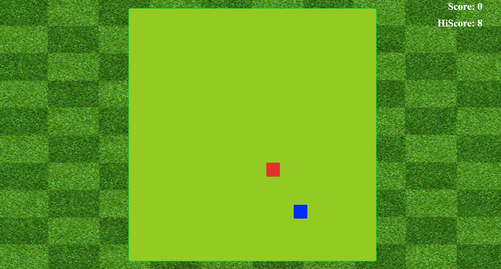
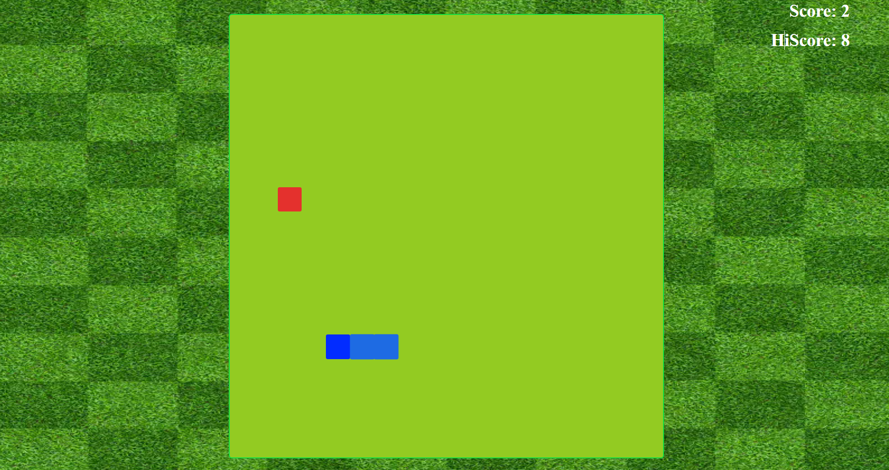

# 🐍 Snake Game

A classic **Snake Game** built using **HTML, CSS, and JavaScript**. Control the snake using arrow keys to eat food 🍎, grow in length, and try not to collide with the walls or yourself 💥.  

---

## ✨ Features

- Smooth snake movement 🟢  
- Score tracking and high score stored in **localStorage** 🏆  
- Food appears randomly 🍎  
- Sound effects for food, movement, and game over 🔊  

---

## 🎮 How to Play

1. Open `index.html` in your browser 🌐  
2. Use **Arrow Keys** to move the snake:  
   - Up: `↑`  
   - Down: `↓`  
   - Left: `←`  
   - Right: `→`  
3. Eat the food 🍎 to grow and increase your score 💯  
4. Avoid colliding with walls or yourself 💥  

---

## 📸 Screenshots

| Snake Game Start | 
|-----------------|
|  | 

|Snake Game During Play |
|----------------------|
| |
---

## 🛠️ Technologies Used

- **HTML5** – Structure of the game 🏗️  
- **CSS3** – Styling and grid layout 🎨  
- **JavaScript (ES6)** – Game logic, movement, collision, and scoring ⚡  

---

## 🔗 GitHub Link

Check out the project repository: [GitHub Link](https://github.com/yourusername/snake-game)  

---

